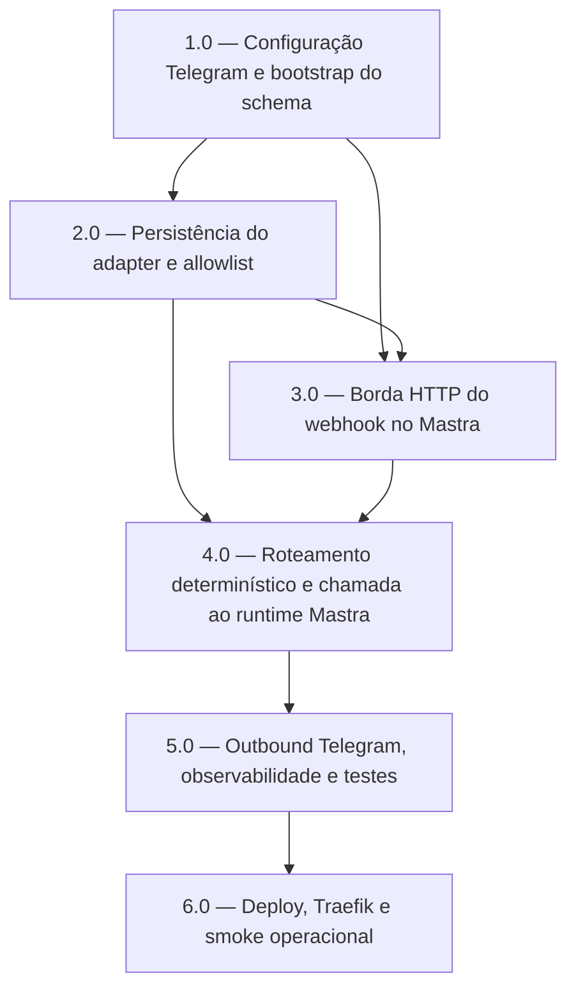

<!-- spec-hash-prd: 1cfb10110b11a1a29fd0ecb9fde11425b9a2a5f8b070e1a478fbafea19a482c2 -->
<!-- spec-hash-techspec: 3ae9257dd2b02a6a0e89438dea169857c2bb1c086c409f8bc197ace6e2e4b267 -->
# Resumo das Tarefas de Implementação para Integração Mastra + Telegram

## Metadados
- **PRD:** `.specs/prd-integracao-mastra-telegram/prd.md`
- **Especificação Técnica:** `.specs/prd-integracao-mastra-telegram/techspec.md`
- **Total de tarefas:** 6
- **Tarefas paralelizáveis:** nenhuma

## Tarefas

<!-- Colunas e formato canônico (MANDATÓRIO):
     - `#`: id decimal `X.Y` (sempre X.0 para tarefas de topo).
     - `Status`: ^(pending|in_progress|needs_input|blocked|failed|done)$
     - `Dependências`: ^(—|\d+\.\d+(,\s*\d+\.\d+)*)$  (em-dash unicode quando vazio)
     - `Paralelizável`: ^(—|Não|Com\s+\d+\.\d+(,\s*\d+\.\d+)*)$
     - `Skills`: skills processuais extras (descoberta agnóstica em `.agents/skills/`). Use `—` quando
       não houver. Nunca listar skills auto-carregadas (governance/linguagem) nem `*-implementation`.
     - `Fase` (OPCIONAL): inteiro positivo para agrupamento visual de fases de entrega. Pode ser
       omitida em PRDs pequenos; `execute-all-tasks` não consome esta coluna. Se incluída, mantenha
       em todas as linhas para não quebrar o parser de tabela markdown. -->

| # | Título | Status | Dependências | Paralelizável | Skills |
|---|--------|--------|-------------|---------------|--------|
| 1.0 | Configuração Telegram e bootstrap do schema | done | — | — | — |
| 2.0 | Persistência do adapter e allowlist | done | 1.0 | Não | — |
| 3.0 | Borda HTTP do webhook no Mastra | done | 1.0, 2.0 | Não | mastra |
| 4.0 | Roteamento determinístico e chamada ao runtime Mastra | done | 2.0, 3.0 | Não | mastra |
| 5.0 | Outbound Telegram, observabilidade e testes | done | 4.0 | Não | mastra |
| 6.0 | Deploy, Traefik e smoke operacional | done | 5.0 | Não | — |

## Dependências Críticas
- `1.0` é bloqueante para todo o restante porque define config, secrets e bootstrap idempotente do schema `agents`.
- `2.0` precisa existir antes da borda HTTP para que deduplicação, allowlist e vínculo `chat -> thread` não fiquem implícitos em memória.
- `5.0` precisa anteceder `6.0` para que o smoke valide o fluxo real completo, não apenas a exposição de rota.

## Riscos de Integração
- Os `telegram_user_id` reais dos dois usuários iniciais ainda não estão provisionados; a implementação deve deixar o canal bloqueado para go-live sem esses IDs.
- O webhook real exige domínio público com HTTPS válido; `mastra.localhost` só cobre desenvolvimento local.
- A convivência entre rota pública do webhook e rotas já protegidas por BasicAuth no Traefik é o ponto de borda mais sensível.

## Cobertura de Requisitos

| Tarefa | Requisitos cobertos |
|--------|-------------------|
| 1.0 | RF-01, RF-02, RF-02a, RF-10, RF-11 |
| 2.0 | RF-02, RF-02a, RF-07, RF-08, RF-09, RF-11, RF-12 |
| 3.0 | RF-01, RF-03, RF-04, RF-09, RF-10, RF-13 |
| 4.0 | RF-05, RF-06, RF-08, RF-14 |
| 5.0 | RF-06, RF-07, RF-09, RF-12, RF-14 |
| 6.0 | RF-01, RF-09, RF-10, RF-12, RF-13 |

## Grafo de Dependencias

## Legenda de Status
- `pending`: aguardando execução
- `in_progress`: em execução
- `needs_input`: aguardando informação do usuário
- `blocked`: bloqueado por dependência ou falha externa
- `failed`: falhou após limite de remediação
- `done`: completado e aprovado
