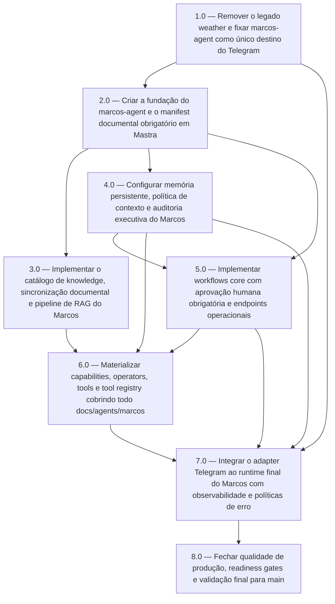

<!-- spec-hash-prd: fc1570dfaf76735b535d09d891136762e22fad5360de0ed32b5e6a2b7f42517d -->
<!-- spec-hash-techspec: a90b8512e60e9a20f6054daa91d073a0c17f5eab4555586dec61f22ec19acca0 -->
# Resumo das Tarefas de Implementação para Substituição Completa do Weather pelo Agente Marcos

## Metadados
- **PRD:** `.specs/prd-substituicao-weather-por-marcos/prd.md`
- **Especificação Técnica:** `.specs/prd-substituicao-weather-por-marcos/techspec.md`
- **Total de tarefas:** 8
- **Tarefas paralelizáveis:** `3.0, 4.0`

## Tarefas

<!-- Colunas e formato canônico (MANDATÓRIO):
     - `#`: id decimal `X.Y` (sempre X.0 para tarefas de topo).
     - `Status`: ^(pending|in_progress|needs_input|blocked|failed|done)$
     - `Dependências`: ^(—|\d+\.\d+(,\s*\d+\.\d+)*)$  (em-dash unicode quando vazio)
     - `Paralelizável`: ^(—|Não|Com\s+\d+\.\d+(,\s*\d+\.\d+)*)$
     - `Skills`: skills processuais extras (descoberta agnóstica em `.agents/skills/`). Use `—` quando
       não houver. Nunca listar skills auto-carregadas (governance/linguagem) nem `*-implementation`.
     - `Fase` (OPCIONAL): inteiro positivo para agrupamento visual de fases de entrega. Pode ser
       omitida em PRDs pequenos; `execute-all-tasks` não consome esta coluna. Se incluída, mantenha
       em todas as linhas para não quebrar o parser de tabela markdown. -->

| # | Título | Status | Dependências | Paralelizável | Skills |
|---|--------|--------|-------------|---------------|--------|
| 1.0 | Remover o legado weather e fixar marcos-agent como único destino do Telegram | done | — | — | mastra |
| 2.0 | Criar a fundação do marcos-agent e o manifest documental obrigatório em Mastra | done | 1.0 | Não | mastra |
| 3.0 | Implementar o catálogo de knowledge, sincronização documental e pipeline de RAG do Marcos | done | 2.0 | Com 4.0 | mastra |
| 4.0 | Configurar memória persistente, política de contexto e auditoria executiva do Marcos | done | 2.0 | Com 3.0 | mastra |
| 5.0 | Implementar workflows core com aprovação humana obrigatória e endpoints operacionais | done | 2.0, 4.0 | Não | mastra |
| 6.0 | Materializar capabilities, operators, tools e tool registry cobrindo todo docs/agents/marcos | done | 3.0, 4.0, 5.0 | Não | mastra |
| 7.0 | Integrar o adapter Telegram ao runtime final do Marcos com observabilidade e políticas de erro | done | 1.0, 4.0, 5.0, 6.0 | Não | mastra |
| 8.0 | Fechar qualidade de produção, readiness gates e validação final para main | done | 7.0 | Não | mastra |

## Dependências Críticas
- `2.0` depende da remoção completa do legado para evitar coexistência ambígua entre `weather` e `Marcos`.
- `3.0` e `4.0` formam a base de contexto e persistência; sem ambas, `5.0`, `6.0` e `7.0` não têm segurança nem completude documental.
- `7.0` só pode iniciar após `6.0`, porque o Telegram não deve expor um `marcos-agent` sem capabilities, operators e tools catalogados.
- `8.0` bloqueia go-live; nenhum merge em `main` deve ocorrer sem os gates de produção definidos nessa tarefa.

## Riscos de Integração
- O escopo documental de `docs/agents/marcos/` é amplo e pode gerar falsa sensação de cobertura se componentes forem apenas nominais; `6.0` precisa validar status real de cada tool e operator.
- A substituição do `weather-agent` altera o fluxo do Telegram já operacional; `1.0` e `7.0` precisam manter o adapter estável enquanto trocam o runtime.
- `3.0` e `4.0` compartilham storage PostgreSQL/Mastra; drift entre knowledge catalog e memory pode comprometer contexto e readiness.
- Aprovação humana via workflow suspensível em `5.0` introduz estados novos de execução; `8.0` deve cobrir retomada e rejeição sem falso positivo.

## Cobertura de Requisitos

| Tarefa | Requisitos cobertos |
|--------|-------------------|
| 1.0 | RF-01, RF-02, RF-02A, RF-03 |
| 2.0 | RF-04, RF-05, RF-06, RF-07, RF-08, RF-09, RF-10, RF-10A |
| 3.0 | RF-04, RF-05, RF-06, RF-11A, RF-16, RF-17, RF-22, RF-23 |
| 4.0 | RF-12, RF-13, RF-14, RF-15, RF-16, RF-18, RF-19, RF-24 |
| 5.0 | RF-11, RF-18, RF-19, RF-19A, RF-21, RF-24 |
| 6.0 | RF-07, RF-08, RF-10, RF-11A, RF-20, RF-21, RF-22, RF-23 |
| 7.0 | RF-01, RF-02, RF-02A, RF-03, RF-18, RF-19, RF-20, RF-22 |
| 8.0 | RF-03, RF-18, RF-21, RF-22, RF-23, RF-24 |

## Grafo de Dependencias

## Legenda de Status
- `pending`: aguardando execução
- `in_progress`: em execução
- `needs_input`: aguardando informação do usuário
- `blocked`: bloqueado por dependência ou falha externa
- `failed`: falhou após limite de remediação
- `done`: completado e aprovado
